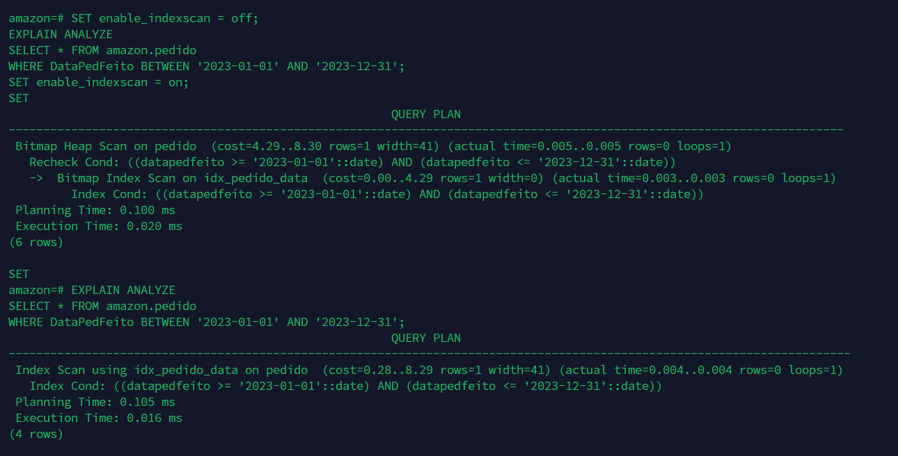

# Índice de Otimização - Sistema de Pedidos

### Índice
- **Nome do Índice:** `idx_pedido_data`
- **Tabela:** `amazon.pedido`
- **Coluna:** `DataPedFeito`
- **Objetivo:** Otimizar as consultas que buscam todos os pedidos de um periodo de tempo.

#### Objetivo
Melhorar a performance de consultas que filtram pedidos por data, especialmente quando são feitas análises ou relatórios sobre um determinado período.

#### Instrução SQL de criação do índice

```sql
CREATE INDEX idx_pedido_data ON amazon.pedido (DataPedFeito);
```

### Caso de uso

Na interface gráfica do sistema, é comum que o usuário deseje visualizar pedidos feitos em determinado período. Exemplo:

```sql
SELECT * FROM amazon.pedido 
WHERE DataPedFeito >= '2025-01-01';
```

### Teste

Para comprovar o ganho de performance, execute a seguinte consulta com `EXPLAIN ANALYZE`:

```sql
EXPLAIN ANALYZE
SELECT * FROM amazon.pedido 
WHERE DataPedFeito >= '2025-01-01';
```

#### Resultado esperado

- **Antes do índice**: o plano de execução mostrará `Seq Scan` (varredura completa da tabela).
- **Depois do índice**: o PostgreSQL deve usar um `Index Scan` ou `Bitmap Index Scan`, o que reduz drasticamente o tempo de leitura em tabelas grandes.


### Quando esse índice é recomendado

- Consultas frequentes filtrando por datas recentes ou por períodos.
- Relatórios gerenciais de pedidos semanais, mensais ou anuais.
- Situações em que o volume de dados em `amazon.pedido` tende a crescer com o tempo.

## Testes

- Teste 1:


- Teste 2:

